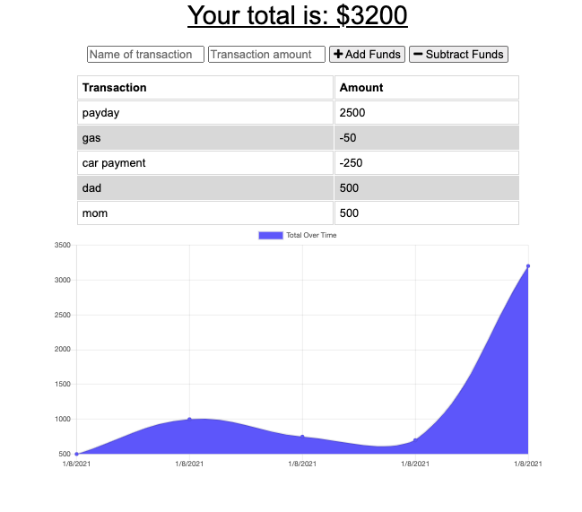

# budget_tracker

# Introduction
*  As a student developer, the project was to build a functionality to existing Budget Tracker application to allow for offline access and functionality.

# Table of Contents
1.  Description
2.  Techologies

#  Description:
1.  The user will be able to add expenses and depsits to their budget with or without a connection.  When entering transcations offline, they should populate the total when brought back online.  

2.  Offline Functionally:
    *  Enter deposits offline
    *  Enter expenses offline
    
3.  When broght back online:
    * Offline entries should  be added to tracker

4.  The user should be able to track their withdrawals and deposits with or without a data/internet connection.  So that the user's  account blanace is accurate when they're traveling.  

# Techologies
1.  HTML5
2.  CSS3
3.  JavaScript
4.  Node JS
5.  VS-Code Editor
6.  GitHub Repository
7.  Heroku
8.  MongoDB Altas
9.  npm packages

## Respository
- [Heroku App](https://young-dawn-41494.herokuapp.com/)
